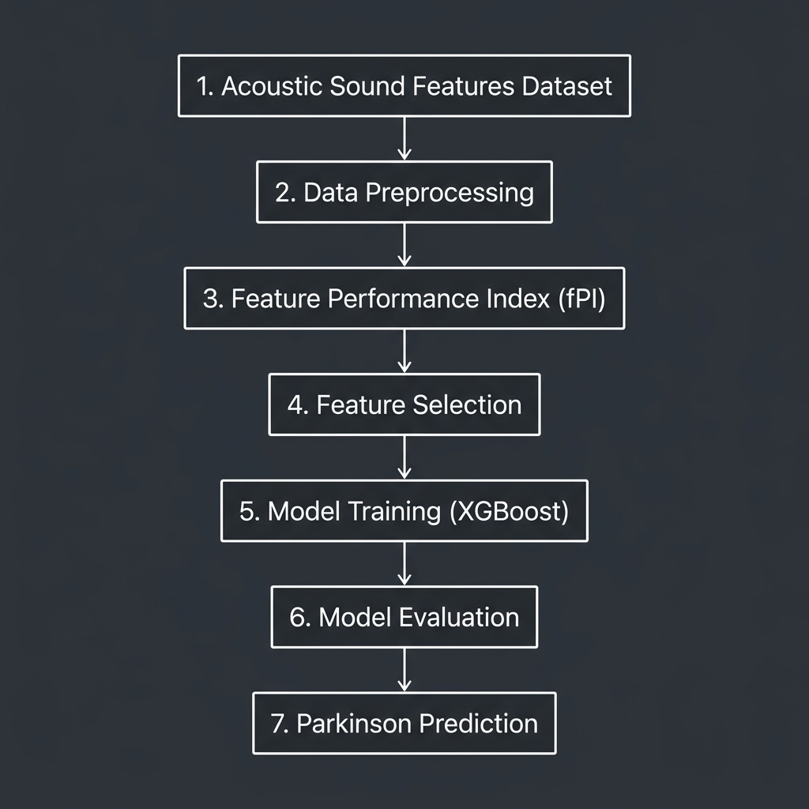

# neuroinsight-ai

### Explainable Parkinson's Disease Prediction Using Vocal Acoustics, the Feature Performance Index (fPI), and XGBoost

[](#)
[](LICENSE)
[](#)
[](#)
[](#)
[](#)

---

## 1. HERO SECTION

**neuroinsight-ai** is an applied machine learning research project exploring the non-invasive prediction of Parkinson's Disease using vocal acoustic biomarkers. By utilizing a custom-engineered **Feature Performance Index (fPI)** alongside advanced tree-based classifiers like **XGBoost**, this project demonstrates how combination features and structured tabular classification can detect early-stage dysphonia with high precision and interpretability.

---

## 2. PROJECT OVERVIEW & RESEARCH OBJECTIVE

Parkinson's Disease is a progressive neurodegenerative disorder characterized by the gradual loss of dopaminergic neurons. While motor symptoms like tremors and rigidity are commonly used for clinical diagnosis, vocal impairment (dysphonia) is often one of the earliest signs of the disease, appearing years before gross motor dysfunction.

Acoustic voice analysis offers a non-invasive, objective, and low-cost biomarker for identifying subtle vocal changes. The objective of this research is to investigate the predictive capability of combination features and to compare standard classification algorithms—including Decision Trees, Support Vector Machines, Random Forests, and XGBoost—for binary classification of healthy controls vs. subjects with Parkinson's Disease.

> [!NOTE]
> This repository represents a research-oriented predictive modeling study using voice recording datasets. It is not designed, certified, or intended for clinical medical diagnosis or diagnostic product use.

---

## 3. TECHNICAL ARCHITECTURE & WORKFLOW

The predictive modeling pipeline is structured into a modular engineering workflow, starting with dataset acquisition and moving sequentially through pre-processing, index engineering, classifier optimization, and performance benchmarking.

<div align="center">
  
</div>

### Workflow Description:
1.  **Acoustic Sound Features Dataset**: Raw vocal acoustic measurements collected from subjects containing fundamental frequency, perturbation measures, and complexity indices.
2.  **Data Preprocessing**: Feature normalization, scaling, and partitioning into stratified train/test folds to prevent data leakage.
3.  **Feature Performance Index (fPI)**: Computation of the engineered fPI combining signal scaling (DFA), complexity (D2), and pitch variation (spread2).
4.  **Feature Selection**: Filtering and correlation-based selection to reduce multicollinearity.
5.  **Model Training (XGBoost)**: Fitting tree-based classifiers and performing hyperparameter tuning using Grid Search.
6.  **Model Evaluation**: Evaluating performance using accuracy, precision, recall, and F1-score.
7.  **Parkinson Prediction**: Outputting classification probability and binary predictions.

---

## 4. TECH STACK

The project is built entirely on standard scientific computing libraries in Python:

*   **Language**: Python
*   **Environment**: Jupyter Notebook
*   **ML Classifiers**: XGBoost, Scikit-Learn
*   **Data Processing**: Pandas, NumPy
*   **Data Visualization**: Matplotlib, Seaborn

---

## 5. REPOSITORY STRUCTURE

The repository is structured logically to separate research documentation, datasets, and codebase modules:

```
neuroinsight-ai/
│
├── README.md               # Project presentation and research summary
├── LICENSE                 # MIT License details
├── .gitignore              # Python and Jupyter git exclusions
├── requirements.txt        # Package dependencies for local execution
│
├── data/                   # Dataset directory
│   ├── pd_data.xlsx        # Excel format voice recordings dataset
│   └── pd_data.txt         # Plaintext metadata and feature information
│
├── notebooks/              # Core research and model development
│   ├── eda.ipynb           # Exploratory data analysis & fPI analysis
│   ├── pd_models.ipynb     # Baseline classifiers (DT, RF, SVM, KNN)
│   └── xgboost_classifier.ipynb # Final XGBoost classification implementation
│
├── docs/                   # PDF research documentation & project files
│   ├── report.pdf          # Full research report
│   ├── parkinsons_prediction.pdf # Predictive analysis details
│   └── problem_statement.pdf # Contextual problem details
│
├── assets/                 # Image assets for documentation
│   ├── architecture.png    # Workflow pipeline diagram
│   └── decision_tree.png   # Decision tree visualization
│
└── testing/
    └── experimental/       # Legacy files and sandbox tests
        ├── pd_alpha.ipynb
        └── pd_beta.ipynb
```

---

## 6. DATASET DESCRIPTION

The analysis utilizes a vocal acoustic dataset containing biomedical voice measurements from **198 subjects** (140 with Parkinson's, 58 healthy controls). The features represent different dimensions of signal perturbation, noise ratios, and nonlinear dynamics:

*   **Vocal Fundamental Frequency**: Average (`MDVP:Fo(Hz)`), maximum (`MDVP:Fhi(Hz)`), and minimum (`MDVP:Flo(Hz)`) pitch.
*   **Vocal Frequency/Amplitude Perturbation**: Jitter (`MDVP:Jitter(%)`, `MDVP:RAP`, `MDVP:PPQ`) and Shimmer (`MDVP:Shimmer`, `Shimmer:APQ3`, `Shimmer:APQ5`, `MDVP:APQ`) measures, representing variations in cycle-to-cycle frequency and amplitude.
*   **Noise Measures**: Noise-to-Harmonic Ratio (`NHR`) and Harmonic-to-Noise Ratio (`HNR`), indicating voice quality degradation.
*   **Nonlinear Dynamics**: Correlation dimension (`D2`) and Recurrence Period Density Entropy (`RPDE`), measuring signal complexity and chaotic behavior.
*   **Fractal Scaling**: Detrended Fluctuation Analysis (`DFA`), measuring the self-similarity of the signal.
*   **Pitch Period Entropy**: `spread1`, `spread2`, and `PPE`, measuring the variability of fundamental frequency.

---

## 7. METHODOLOGY

The methodology focuses on leveraging domain-specific feature engineering to improve the signal separation between healthy controls and Parkinson's subjects.

### Preprocessing & Feature Engineering
Features are scaled to normalize variance across different acoustic units. During Exploratory Data Analysis, high correlation was identified between frequency variation and chaotic complexity measures. This led to the engineering of the **Feature Performance Index (fPI)**:

$$\text{fPI} = \log_{10}(\text{DFA} \times \text{D2} \times \text{spread2})$$

*   **D2 (Nonlinear Complexity)**: Captures the chaotic structure of the vocal fold vibration.
*   **DFA (Fractal Scaling)**: Expresses the fractal dimension of the speech signal.
*   **spread2 (Frequency Variation)**: Quantifies fundamental frequency variance.

By combining scaling exponents, chaotic dynamics, and pitch variation into a single composite log-index, the fPI serves as a powerful acoustic biomarker that highlights subtle voice irregularities.

---

## 8. MODEL DEVELOPMENT & EVALUATION

Multiple machine learning classifiers were evaluated to compare baseline performance against the final gradient boosted trees model.

### Model Performance Summary

| Model | Classification Accuracy | Class 0 Precision | Class 0 Recall | Class 1 Precision | Class 1 Recall |
| :--- | :---: | :---: | :---: | :---: | :---: |
| **XGBoost** | **86.44%** | **0.86** | **0.78** | **0.87** | **0.90** |
| **Random Forest** (Baseline) | **91.52%** | 0.85 | 0.92 | 0.96 | 0.93 |
| **Decision Tree** (Baseline) | **89.83%** | 0.82 | 0.88 | 0.93 | 0.88 |
| **Random Forest** (Tuned) | **85.00%** | 0.75 | 0.75 | 0.89 | 0.89 |
| **Decision Tree** (Tuned) | **82.00%** | 0.78 | 0.58 | 0.83 | 0.93 |
| **SVM** (Tuned) | **82.00%** | 0.78 | 0.58 | 0.83 | 0.93 |
| **K-Nearest Neighbors** | **79.00%** | 0.75 | 0.50 | 0.81 | 0.93 |

The decision tree structural layout is visualized under `assets/decision_tree.png` to examine splits on features such as `PPE` and the fPI components, showcasing feature splits that drive classification decisions.

---

## 9. NOTEBOOK SHOWCASE

The project codebase is partitioned into three distinct notebooks representing the research lifecycle:

1.  **[eda.ipynb](notebooks/eda.ipynb)**: Performs initial dataset loading, distribution checks, missing value validation, correlation analyses, and explores the math behind the Feature Performance Index (fPI).
2.  **[pd_models.ipynb](notebooks/pd_models.ipynb)**: Implements training pipelines for baseline classifiers (K-Nearest Neighbors, Decision Trees, Random Forest, and SVM) and conducts GridSearchCV hyperparameter optimization.
3.  **[xgboost_classifier.ipynb](notebooks/xgboost_classifier.ipynb)**: Configures and evaluates the final XGBoost classification pipeline, generating accuracy scores and comparing results against baseline performance.

---

## 10. SAMPLE PREDICTION WORKFLOW

To evaluate a new sample point using the trained classifiers, the input vocal acoustic features must be prepared and evaluated using the standard prediction pipeline:

```python
import numpy as np
import pandas as pd
import xgboost as xgb

# 1. Define sample input features (using dataset columns)
sample_data = {
    'MDVP:Fo(Hz)': 119.99, 'MDVP:Fhi(Hz)': 157.30, 'MDVP:Flo(Hz)': 74.99,
    'MDVP:Jitter(%)': 0.00784, 'MDVP:Jitter(Abs)': 0.00007, 'MDVP:RAP': 0.00370,
    'MDVP:PPQ': 0.00554, 'Jitter:DDP': 0.01109, 'MDVP:Shimmer': 0.04374,
    'MDVP:Shimmer(dB)': 0.426, 'Shimmer:APQ3': 0.02182, 'Shimmer:APQ5': 0.03130,
    'MDVP:APQ': 0.02971, 'Shimmer:DDA': 0.06545, 'NHR': 0.02211, 'HNR': 21.033,
    'RPDE': 0.41478, 'DFA': 0.81528, 'spread1': -4.81303, 'spread2': 0.266482,
    'D2': 2.301442, 'PPE': 0.284654
}

df_sample = pd.DataFrame([sample_data])

# 2. Compute fPI (Feature Performance Index)
df_sample['fPI'] = np.log10(df_sample['DFA'] * df_sample['D2'] * df_sample['spread2'])

# 3. Load model and predict probability
xgb_model = xgb.XGBClassifier()
# Assume model is pre-fitted and loaded from disk
# xgb_model.load_model("xgb_parkinsons.model")
# prediction = xgb_model.predict(df_sample)
```

---

## 11. RESEARCH INSIGHTS

*   **Predictive Signal Strength**: Perturbation measures like `PPE` (Pitch Period Entropy) and amplitude variations (`Shimmer`) exhibit high predictive signal strength, highlighting vocal fold control issues in subjects.
*   **Complexity Metrics**: Signal complexity (`D2`) and Recurrence Period Density Entropy (`RPDE`) prove critical in differentiating healthy voice profiles from Parkinson's dysphonia, capturing irregular vocal frequencies.
*   **Model Performance**: Tree-based ensembles (Random Forest and XGBoost) outperform linear classifiers (SVM) and distance-based metrics (KNN) by handling non-linear feature interactions and high-dimensional boundaries without overfitting.
*   **Explainability Value**: The fPI provides a mathematically grounded composite metric that correlates strongly with diagnostic state, reducing raw feature complexity while maintaining physical acoustic meaning.

---

## 12. FUTURE IMPROVEMENTS

*   **Broader Dataset Validation**: Testing the classifiers and the engineered fPI on external voice acoustic datasets to verify cross-dataset generalizability.
*   **Deeper Feature Engineering**: Formulating alternative perturbation indices targeting cycle-to-cycle frequency variations (jitter) and vocal shimmer.
*   **Model Explainability Expansion**: Implementing SHAP (SHapley Additive exPlanations) or LIME to mathematically map the contribution of each vocal feature in individual predictions.
*   **Longitudinal Studies**: Exploring vocal changes over time using clinical datasets to assess prediction stability across different stages of degeneration.
